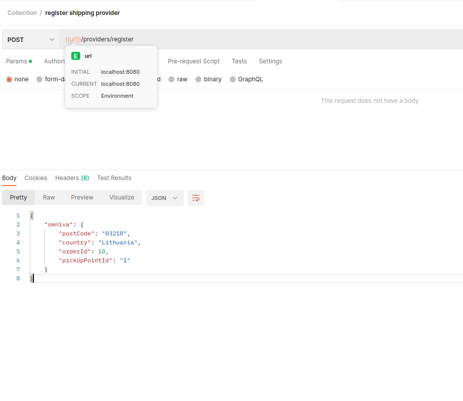

### Local project set up
To set up services run `docker-compose up -d --build`

### Postman
extra feature :)\
\

### Register Shipment
Run command with provided shipping provider keys `omniva`, `ups`, `dhl`:\
`php bin/console app:register-shipment --shippingProviderKey=omniva`

# PHP Developer Exercise for Boozt

## Prerequisites
Here at Boozt we ship hundreds of packages per one month to Scandinavia and other parts of Europe. In order to provide the best service for our customers we are constantly expanding the pallet of Shipping Providers (currently there are more than 10). That is why is very important to have simple and reliable way to add more shipping providers.

Exercise provides a basic framework with Order entity and service, so you could spend less time bootstrapping the project, however feel free to taylor it according to your needs

### Requirements
- We expect this to be Unit tested. It is not a requirement to have 100% coverage, but basic functionality should be tested.
- APIs should be mocked, returning hard-coded results.
- Even though exercise contains 3 providers only, design your code to be extensible and as flexible as possible. Implementing new providers should be very straightforward. If you want you can do only 2 shipping providers.
- Do not implement any persistence layer or ORM, entity should be constructed with mock data.

### Problem
Please implement a console command which would register a shipment for given shipping provider key. Provider key could be passed as an argument from STDIN. The rest order data could be mocked.

Each shipping provider could deliver the Order (`\App\Entity\Order`), however in the future we might add validation to limit supported providers. Provider is chosen by `\App\Entity\Order::getShippingProviderKey` method which returns provider key: __ups__, __omniva__ or __dhl__.
Shipment is registered by calling `\App\Service\Order::registerShipping` method, which should ensure a chosen provider is notified about the new shipment.

Command should exit if shipment has been registered successfully.

### Provider specifications
- **UPS**, send by api to `upsfake.com/register` -> `order_id`, `country`, `street`, `city`, `post_code`
- **OMNIVA** - get pick up point id by calling the api `omnivafake.com/pickup/find` : `country`, `post_code`, then send registration to `omnivafake.com/register` using `pickup_point_id` and `order_id`
- **DHL**, send by api to `dhlfake.com/register` -> `order_id`, `country`, `address`, `town`, `zip_code` 

### Evaluation Criteria
We will evaluate code based on these criteria:
- Code functions as specified in the Problem
- Whether tests pass (`php bin/phpunit ./tests`)
- Code readability and quality
- System flexibility and extensibility
